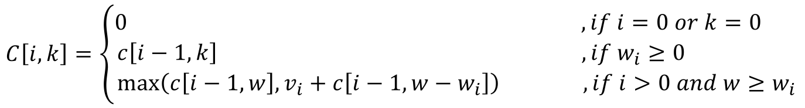

# 0-1 Knapsack Problem

## Problem

---

Given __n__ items and each of item has __w__ weight and __v__ value and you have a backpack. The question is
take the most valuable thins to your backpack as possible as your backpack can contain them.
<br>
BTW, you must take __a__ whole thing, those of them couldn't separated.

## Thought

---

The simplest thinking is __greedy__ algorithm. That we could calculate the value of a unit of each things.
Then we put them in my backpack by sequence.

Backpack can contain __w__ = 5 Kg.

```
items   value   weight
1       6       1
2       10      2
3       12      3
```

item<sub>1</sub> => v<sub>1</sub> / w<sub>1</sub> = 6
<br>
item<sub>2</sub> => v<sub>2</sub> / w<sub>2</sub> = 5
<br>
item<sub>3</sub> => v<sub>3</sub> / w<sub>3</sub> = 4

We get items' order is item<sub>1</sub> > item<sub>2</sub> > item<sub>3</sub>.
<br>
1. Pick item<sub>1</sub> first to the backpack. Remain 4 Kg, Value is 6.
2. Then pick item<sub>2</sub> to the backpack. Remain 2 Kg, Value is 16.
3. The backpack couldn't contain anymore.

But actually, that's not the best way to pick.

We use __dynamic programming__ algorithm to get the best way.
<br>
The best way is item x<sub>1</sub>, x<sub>2</sub>, ..., x<sub>k</sub> and x<sub>1</sub> < x<sub>2</sub> < ...
< x<sub>k</sub>, then
<br>
1. if x<sub>k</sub> ≠ n, then item 1 ~ n-1 will be in  x<sub>1</sub> ~ x<sub>k</sub> and total weight is under
W, and this is the best solution.
2. if x<sub>k</sub> = n, then item 1 ~ n-1 will be in  x<sub>1</sub> ~ x<sub>k</sub> and total weight is under
W - w<sub>n</sub>, and this is the best solution.


## Algorithm

---

#### Recursion Form



## Solution

---

A scenario is that a backpack weight limitation is __5__, and there are three items as below:
<br>

```
items   value   weight
1       6       1
2       10      2
3       12      3
```

##### step 1: Initialize

The row items mean __weight__, the col items mean __item__.

|   | 0 | 1 | 2 | 3 | 4 | 5 |
|:-:|:-:|:-:|:-:|:-:|:-:|:-:|
| 0 | 0 | 0 | 0 | 0 | 0 | 0 |
| 1 | 0 | 0 | 0 | 0 | 0 | 0 |
| 2 | 0 | 0 | 0 | 0 | 0 | 0 |
| 3 | 0 | 0 | 0 | 0 | 0 | 0 |

##### step 2:

∵ k = 1 ≧ w<sub>1</sub> = 1
<br>
∴ c[1, 1] = max(c[0, 1], 6 + c[0, 0]) = 6

|   | 0 |             1              | 2 | 3 | 4 | 5 |
|:-:|:-:|:--------------------------:|:-:|:-:|:-:|:-:|
| 0 | 0 |             0              | 0 | 0 | 0 | 0 |
| 1 | 0 | <font color="red">6</font> | 0 | 0 | 0 | 0 |
| 2 | 0 |             0              | 0 | 0 | 0 | 0 |
| 3 | 0 |             0              | 0 | 0 | 0 | 0 |

##### ...3...4...5...6...

##### step 7:

∵ k = 1 < w<sub>2</sub> = 2
<br>
∴ c[2, 1] = c[1, 1] = 6

|   | 0 |             1              | 2 | 3 | 4 | 5 |
|:-:|:-:|:--------------------------:|:-:|:-:|:-:|:-:|
| 0 | 0 |             0              | 0 | 0 | 0 | 0 |
| 1 | 0 |             6              | 6 | 6 | 6 | 6 |
| 2 | 0 | <font color="red">6</font> | 0 | 0 | 0 | 0 |
| 3 | 0 |             0              | 0 | 0 | 0 | 0 |

##### step 8:

∵ k = 2 < w<sub>2</sub> = 2
<br>
∴ c[2, 2] = max(c[1, 1], 10 + c[1, 0]) = 10

|   | 0 | 1 |              2              | 3 | 4 | 5 |
|:-:|:-:|:-:|:---------------------------:|:-:|:-:|:-:|
| 0 | 0 | 0 |              0              | 0 | 0 | 0 |
| 1 | 0 | 6 |              6              | 6 | 6 | 6 |
| 2 | 0 | 6 | <font color="red">10</font> | 0 | 0 | 0 |
| 3 | 0 | 0 |              0              | 0 | 0 | 0 |

##### ...9...10...11...12...13...

##### step 14:

∵ k = 3 ≧ w<sub>3</sub> = 3
<br>
∴ c[3, 3] = max(c[2, 3], 12 + c[2, 0]) = 16

|   | 0 | 1 | 2  |              3              | 4  | 5  |
|:-:|:-:|:-:|:--:|:---------------------------:|:--:|:--:|
| 0 | 0 | 0 | 0  |              0              | 0  | 0  |
| 1 | 0 | 6 | 6  |              6              | 6  | 6  |
| 2 | 0 | 6 | 10 |             16              | 16 | 16 |
| 3 | 0 | 6 | 10 | <font color="red">16</font> | 0  | 0  |

##### ...15...

##### step final:

∵ k = 5 ≧ w<sub>3</sub> = 3
<br>
∴ c[3, 5] = max(c[2, 5], 12 + c[2, 2]) = 22

|   | 0 | 1 | 2  | 3  | 4  |              5              |
|:-:|:-:|:-:|:--:|:--:|:--:|:---------------------------:|
| 0 | 0 | 0 | 0  | 0  | 0  |              0              |
| 1 | 0 | 6 | 6  | 6  | 6  |              6              |
| 2 | 0 | 6 | 10 | 16 | 16 |             16              |
| 3 | 0 | 6 | 10 | 16 | 18 | <font color="red">22</font> |


## Complexity

---

Time Complexity: __Big-O(nw)__
<br>
Space Complexity: __Big-O(nw)__

## Source Code

---

