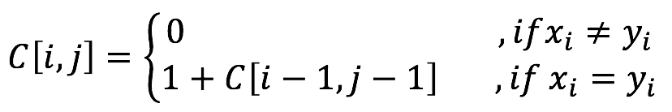

# Longest Common Substring

## Problem
---
Given two strings __'ACBAD'__ and __'ABAC'__ for the input. Your mission is finding a longest common string from this two strings. 
As this input example, you can find a longest common string is __'ABA'__ from them so the answer will be 3.

## Thought
---
We have a thinking is using __*brute-force attack*__ to solve it.
 
1. Show all of the X's substring.
2. Show all of the Y's substring.
3. Pick up the same all substring and chose the longest substring from them.

We can try to calculate the time complexity of them.
 
_Step 1_ Big-O(2^len(X)).
 
_Step 2_ Big-O(2^len(Y)).
 
_Step 3_ We don't need to calculate it because it will be exponential time.
 
This is totally not a good way to solve it.

 
The other way, we try to use __*dynamic programming*__.
 
We can start considering a optimal substructure. Here are two strings X:_GOOD_, Y:_GOTO_, and Z is LCS(X, Y). We can find the same word from the tail of both of strings, we can know there are three conditions will be happened.
1. if __Xt = Yt__ then __Zt <- the tail of the same word__.
2. if __Xt != Yt__ then __Zt <- the__.

## Algorithm
---
#### Recursion Form

You can see the form as below:
 

## Solution
---
String A: ABCDF
 
String B: ACDCFD

##### step 1: Initialize

|   |   | A | B | C | D | F |
|:-:|:-:|:-:|:-:|:-:|:-:|:-:|
|   | 0 | 0 | 0 | 0 | 0 | 0 |
| A | 0 | 0 | 0 | 0 | 0 | 0 |
| C | 0 | 0 | 0 | 0 | 0 | 0 |
| D | 0 | 0 | 0 | 0 | 0 | 0 |
| C | 0 | 0 | 0 | 0 | 0 | 0 |
| F | 0 | 0 | 0 | 0 | 0 | 0 |
| D | 0 | 0 | 0 | 0 | 0 | 0 |

##### step 2:

|   |   | A | B | C | D | F |
|:-:|:-:|:-:|:-:|:-:|:-:|:-:|
|   | 0 | 0 | 0 | 0 | 0 | 0 |
| A | 0 | 1 ↘ | 0 | 0 | 0 | 0 |
| C | 0 | 0 | 0 | 0 | 0 | 0 |
| D | 0 | 0 | 0 | 0 | 0 | 0 |
| C | 0 | 0 | 0 | 0 | 0 | 0 |
| F | 0 | 0 | 0 | 0 | 0 | 0 |
| D | 0 | 0 | 0 | 0 | 0 | 0 |

##### step 3:

|   |   | A | B | C | D | F |
|:-:|:-:|:-:|:-:|:-:|:-:|:-:|
|   | 0 | 0 | 0 | 0 | 0 | 0 |
| A | 0 | 1 | 1 → | 0 | 0 | 0 |
| C | 0 | 0 | 0 | 0 | 0 | 0 |
| D | 0 | 0 | 0 | 0 | 0 | 0 |
| C | 0 | 0 | 0 | 0 | 0 | 0 |
| F | 0 | 0 | 0 | 0 | 0 | 0 |
| D | 0 | 0 | 0 | 0 | 0 | 0 |

##### step 4:

|   |   | A | B | C | D | F |
|:-:|:-:|:-:|:-:|:-:|:-:|:-:|
|   | 0 | 0 | 0 | 0 | 0 | 0 |
| A | 0 | 1 ↘ | 1 → | 1 → | 0 | 0 |
| C | 0 | 0 | 0 | 0 | 0 | 0 |
| D | 0 | 0 | 0 | 0 | 0 | 0 |
| C | 0 | 0 | 0 | 0 | 0 | 0 |
| F | 0 | 0 | 0 | 0 | 0 | 0 |
| D | 0 | 0 | 0 | 0 | 0 | 0 |

##### ...5...6...

##### step 7:

|   |   | A | B | C | D | F |
|:-:|:-:|:-:|:-:|:-:|:-:|:-:|
|   | 0 | 0 | 0 | 0 | 0 | 0 |
| A | 0 | 1 ↘ | 1 → | 1 → | 1 → | 1 → |
| C | 0 | 1 ↓ | 0 | 0 | 0 | 0 |
| D | 0 | 0 | 0 | 0 | 0 | 0 |
| C | 0 | 0 | 0 | 0 | 0 | 0 |
| F | 0 | 0 | 0 | 0 | 0 | 0 |
| D | 0 | 0 | 0 | 0 | 0 | 0 |

##### ...8...

##### step 9:

|   |   | A | B | C | D | F |
|:-:|:-:|:-:|:-:|:-:|:-:|:-:|
|   | 0 | 0 | 0 | 0 | 0 | 0 |
| A | 0 | 1 ↘ | 1 → | 1 → | 1 → | 1 → |
| C | 0 | 1 ↓ | 1 ↓ | 2 ↘ | 0 | 0 |
| D | 0 | 0 | 0 | 0 | 0 | 0 |
| C | 0 | 0 | 0 | 0 | 0 | 0 |
| F | 0 | 0 | 0 | 0 | 0 | 0 |
| D | 0 | 0 | 0 | 0 | 0 | 0 |

##### step 10:

|   |   | A | B | C | D | F |
|:-:|:-:|:-:|:-:|:-:|:-:|:-:|
|   | 0 | 0 | 0 | 0 | 0 | 0 |
| A | 0 | 1 ↘ | 1 → | 1 → | 1 → | 1 → |
| C | 0 | 1 ↓ | 1 ↓ | 2 ↘ | 2 → | 0 |
| D | 0 | 0 | 0 | 0 | 0 | 0 |
| C | 0 | 0 | 0 | 0 | 0 | 0 |
| F | 0 | 0 | 0 | 0 | 0 | 0 |
| D | 0 | 0 | 0 | 0 | 0 | 0 |

##### ...11...12...13...14...15...16...17.......

##### final:

|   |   | A | B | C | D | F |
|:-:|:-:|:-:|:-:|:-:|:-:|:-:|
|   | 0 | 0 | 0 | 0 | 0 | 0 |
| A | 0 | 1 ↘ | 1 → | 1 → | 1 → | 1 → |
| C | 0 | 1 ↓ | 1 → | 2 ↘ | 2 → | 2 → |
| D | 0 | 1 ↓ | 1 → | 2 → | 3 ↘ | 3 → |
| C | 0 | 1 ↓ | 1 → | 2 ↘ | 3 ↓ | 3 → |
| F | 0 | 1 ↓ | 1 → | 2 → | 3 ↓ | 4 ↘ |
| D | 0 | 1 ↓ | 1 → | 2 ↓ | 3 ↘ | 4 ↓ |

So, the max length result: __4__

#### Backtracking

We can use backtracking to find the string we recorded.

|   |   | A | B | C | D | F |
|:-:|:-:|:-:|:-:|:-:|:-:|:-:|
|   | 0 | 0 | 0 | 0 | 0 | 0 |
| A | 0 | 1 ↘ | 1 → | 1 → | 1 → | 1 → |
| C | 0 | 1 ↓ | 1 → | 2 ↘ | 2 → | 2 → |
| D | 0 | 1 ↓ | 1 → | 2 → | 3 ↘ | 3 → |
| C | 0 | 1 ↓ | 1 → | 2 ↘ | 3 ↓ | 3 → |
| F | 0 | 1 ↓ | 1 → | 2 → | 3 ↓ | 4 ↘ |
| D | 0 | 1 ↓ | 1 → | 2 ↓ | 3 ↘ | 4 ↓ |

the max string result: __ACDF__

## Complexity
---
Time Complexity: __Big-O(mn)__
 
Space Complexity: __Big-O(mn)__

## Source Code
---
URL
