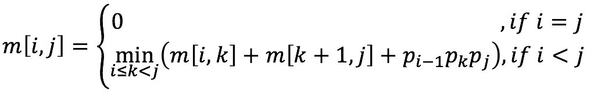

# Matrix Chain Multiplication

## Problem
---
Given a sequence of matrices, the goal is to find the most efficient way to multiply these matrices. The problem is not actually to _perform_ the multiplications, but merely to decide the sequence of the matrix multiplications involved.

For example, a sequence of matrices is A1 x A2 x A3,
<br>
A1: 10 x 100
<br>
A2: 100 x 5
<br>
A3: 5 x 50

1. ((A1 x A2) x A3): (10 x 100 x 5) + (10 x 5 x 50) = 7500
<br>
2. (A1 x (A2 x A3)): (100 x 5 x 50) + (10 x 100 x 50) = 75000
<br>

If we choose the second one, the multiplications will be huge difference from the first. The best choice is the first.

## Thought
---
We have a thinking is using __*brute-force attack*__ to solve it.
<br>
If there are a sequence of n matrices, then we can find __C(n-1) = 1/n x (2n - 1)C(n - 1)__ ways of the multiplications.
<br>
This is no a way to solve this problem. :(

<br>
The other way, we try to use __*dynamic programming*__.
If P is a way of the less multiplications of Ai x Ai+1 x ... x Aj. Then we can find P1 and P2 are the most efficient way, which are p1 is A1 x ... x Ak and p2 is Ak+1 x ... x Aj.
<br>
The result => P = (A1 x ... x Ak) x (Ak+1 x ... x Aj).

## Algorithm
---
#### Recursion Form


#### Concept
A1 x A2 x A3 x A4 x A5
<br>
L = 1, 2, 3, 4, 5
<br>
L = 1 => A1, A2, A3, A4, A5
<br>
L = 2 => A1 x A2, A2 x A3, A3 x A4, A4 x A5
<br>
L = 3 => A1 x A2 x A3, A2 x A3 x A4, A3 x A4 x A5
<br>
L = 4 => A1 x A2 x A3 x A4, A2 x A3 x A4 x A5
<br>
L = 5 => A1 x A2 x A3 x A4 x A5

## Solution
---
Here is a matrix __A1 x A2 x A3 x A4 x A5__.
<br>
A1: 4x3
<br>
A2: 3x2
<br>
A3: 2x5
<br>
A4: 5x4
<br>
A5: 4x2
<br>

##### step 1: Initialize

|   | 0 | 1 | 2 | 3 | 4 | 5 |
|:-:|:-:|:-:|:-:|:-:|:-:|:-:|
| 0 | 0 | 0 | 0 | 0 | 0 | 0 |
| 1 | 0 | 0 | 0 | 0 | 0 | 0 |
| 2 | 0 | 0 | 0 | 0 | 0 | 0 |
| 3 | 0 | 0 | 0 | 0 | 0 | 0 |
| 4 | 0 | 0 | 0 | 0 | 0 | 0 |
| 5 | 0 | 0 | 0 | 0 | 0 | 0 |


First, we fill up all __*i = j*__.
<br>
The matrix will be as below:

##### step 2:

All of the __k = 1__ case.

|   | 0 | 1 | 2 | 3 | 4 | 5 |
|:-:|:-:|:-:|:-:|:-:|:-:|:-:|
| 0 | <font color="gray">0</font> | <font color="gray">0</font> | <font color="gray">0</font> | <font color="gray">0</font> | <font color="gray">0</font> | <font color="gray">0</font> |
| 1 | <font color="gray">0</font> | <font color="red">0</font> | 0 | 0 | 0 | 0 |
| 2 | <font color="gray">0</font> | 0 | <font color="red">0</font> | 0 | 0 | 0 |
| 3 | <font color="gray">0</font> | 0 | 0 | <font color="red">0</font> | 0 | 0 |
| 4 | <font color="gray">0</font> | 0 | 0 | 0 | <font color="red">0</font> | 0 |
| 5 | <font color="gray">0</font> | 0 | 0 | 0 | 0 | <font color="red">0</font> |

##### step 3:

Current __k = 2__.
<br>
We gonna find __m[1, 2]__: A1 x A2
<br>
So, here we go.

```
k = 1 -> (A1 x A2) = 4 x 3 x 2 = 24
```

Here is only a case so minimum is __24__, we filled the m[1, 2] = 24.

|   | 0 | 1 | 2 | 3 | 4 | 5 |
|:-:|:-:|:-:|:-:|:-:|:-:|:-:|
| 0 | <font color="gray">0</font> | <font color="gray">0</font> | <font color="gray">0</font> | <font color="gray">0</font> | <font color="gray">0</font> | <font color="gray">0</font> |
| 1 | <font color="gray">0</font> | 0 | <font color="red">24</font> | 0 | 0 | 0 |
| 2 | <font color="gray">0</font> | 0 | 0 | 0 | 0 | 0 |
| 3 | <font color="gray">0</font> | 0 | 0 | 0 | 0 | 0 |
| 4 | <font color="gray">0</font> | 0 | 0 | 0 | 0 | 0 |
| 5 | <font color="gray">0</font> | 0 | 0 | 0 | 0 | 0 |

##### step 4:

Current __k = 2__.
<br>
We gonna find __m[2, 3]__: A2 x A3

```
k = 1 -> (A2 x A3) = 3 x 2 x 5 = 30
```

Here is only a case so minimum is __30__, too. We filled the m[1, 2] = 30.

|   | 0 | 1 | 2 | 3 | 4 | 5 |
|:-:|:-:|:-:|:-:|:-:|:-:|:-:|
| 0 | <font color="gray">0</font> | <font color="gray">0</font> | <font color="gray">0</font> | <font color="gray">0</font> | <font color="gray">0</font> | <font color="gray">0</font> |
| 1 | <font color="gray">0</font> | 0 | 24 | 0 | 0 | 0 |
| 2 | <font color="gray">0</font> | 0 | 0 | <font color="red">30</font> | 0 | 0 |
| 3 | <font color="gray">0</font> | 0 | 0 | 0 | 0 | 0 |
| 4 | <font color="gray">0</font> | 0 | 0 | 0 | 0 | 0 |
| 5 | <font color="gray">0</font> | 0 | 0 | 0 | 0 | 0 |

##### ...5...6...7...

##### step 8:

Current __k = 3__.
<br>
We gonna find __m[1, 3]__: A1 x A2 x A3

```
k = 1 -> (A1 x (A2 x A3)) = 0 + m[2, 3] + (4 x 3 x 5) = 90
k = 2 -> ((A1 x A2) x A3) = m[1, 2] + 0 + (4 x 2 x 5) = 64
```

There are two cases, we picked up the minimum case to fill in m[1, 3].
<br>
m[1, 3] will be __64__.

|   | 0 | 1 | 2 | 3 | 4 | 5 |
|:-:|:-:|:-:|:-:|:-:|:-:|:-:|
| 0 | <font color="gray">0</font> | <font color="gray">0</font> | <font color="gray">0</font> | <font color="gray">0</font> | <font color="gray">0</font> | <font color="gray">0</font> |
| 1 | <font color="gray">0</font> | 0 | 24 | <font color="red">64</font> | 0 | 0 |
| 2 | <font color="gray">0</font> | 0 | 0 | 30 | 0 | 0 |
| 3 | <font color="gray">0</font> | 0 | 0 | 0 | 40 | 0 |
| 4 | <font color="gray">0</font> | 0 | 0 | 0 | 0 | 40 |
| 5 | <font color="gray">0</font> | 0 | 0 | 0 | 0 | 0 |

##### ...9...10...11...

##### step 12:

Current __k = 4__.
<br>
We gonna find __m[2, 5]__: A2 x A3 x A4 x A5

```
k = 1 -> (A2 x (A3 x A4 x A5)) = 0 + m[3, 5] + (3 x 2 x 2) = 68
k = 2 -> ((A2 x A3) x (A4 x A5)) = m[2, 3] + m[4, 5] + (3 x 5 x 2) = 100
k = 3 -> ((A2 x A3 x A4) x A5) = m[2, 4] + 0 + (3 x 4 x 2) = 88
```

There are three cases, we picked up the minimum case to fill in m[2, 5].
<br>
m[2, 5] will be __68__.

|   | 0 | 1 | 2 | 3 | 4 | 5 |
|:-:|:-:|:-:|:-:|:-:|:-:|:-:|
| 0 | <font color="gray">0</font> | <font color="gray">0</font> | <font color="gray">0</font> | <font color="gray">0</font> | <font color="gray">0</font> | <font color="gray">0</font> |
| 1 | <font color="gray">0</font> | 0 | 24 | 64 | 96 | 0 |
| 2 | <font color="gray">0</font> | 0 | 0 | 30 | 64 | <font color="red">68</font> |
| 3 | <font color="gray">0</font> | 0 | 0 | 0 | 40 | 56 |
| 4 | <font color="gray">0</font> | 0 | 0 | 0 | 0 | 40 |
| 5 | <font color="gray">0</font> | 0 | 0 | 0 | 0 | 0 |

##### step final:

|   | 0 | 1 | 2 | 3 | 4 | 5 |
|:-:|:-:|:-:|:-:|:-:|:-:|:-:|
| 0 | <font color="gray">0</font> | <font color="gray">0</font> | <font color="gray">0</font> | <font color="gray">0</font> | <font color="gray">0</font> | <font color="gray">0</font> |
| 1 | <font color="gray">0</font> | 0 | 24 | 64 | 96 | <font color="red">92</font> |
| 2 | <font color="gray">0</font> | 0 | 0 | 30 | 64 | 68 |
| 3 | <font color="gray">0</font> | 0 | 0 | 0 | 40 | 56 |
| 4 | <font color="gray">0</font> | 0 | 0 | 0 | 0 | 40 |
| 5 | <font color="gray">0</font> | 0 | 0 | 0 | 0 | 0 |

So, the max length result: __92__

#### Backtracking

We need to keep some steps from __K__ of the minimum. __*m[n, n]*__ this case, we can just skip it because it's finished.
<br>
For this example,
<br><br>
m[1, 5] => k = 1
<br>
__(__ A1 x __(__ A2 x A3 x A4 x A5 __)__ __)__
<br><br>
Backtracking to m[1, 1] and m[2, 5].
<br>
m[2, 5] => k = 2
<br>
( A1 x (A2 x __(__ A3 x A4 x A5 __)__ ) )
<br><br>
Backtracking to m[2, 2] and m[3, 5].
<br>
m[3, 5] => k = 4
<br>
( A1 x ( A2 x ( __(__ A3 x A4 __)__ x A5 ) ) )
<br><br>
Backtracking to m[3, 4] and m[5, 5].
<br>
m[3, 4] => k = 3
<br>
Backtracking to m[3, 3] and m[4, 4]. We done this case.


## Complexity
---
Time Complexity: __Big-O(n<sup>3</sup>)__
<br>
Space Complexity: __Big-O(n<sup>2</sup>)__

## Source Code
---
